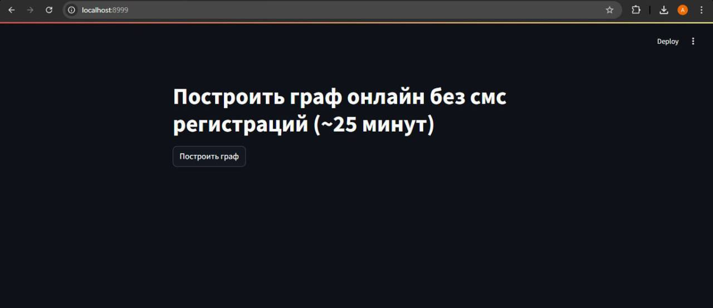
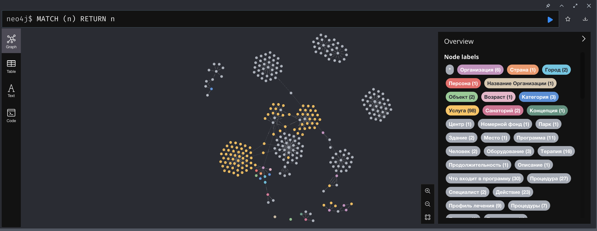
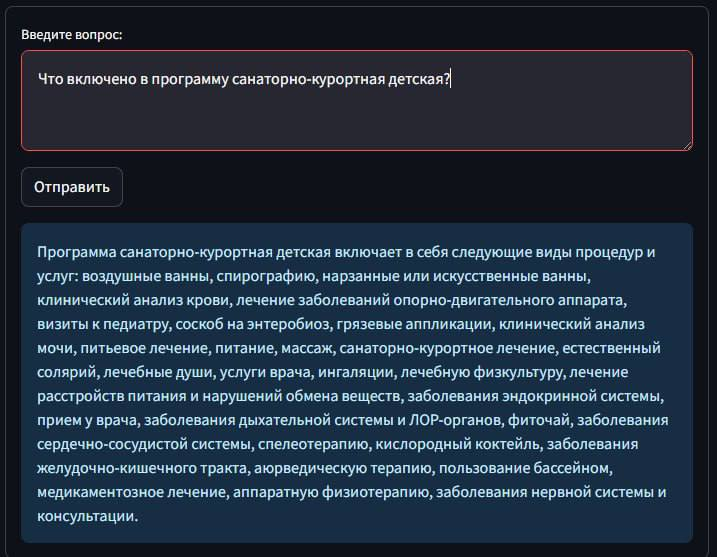

# Question Answering using Knowledge Graph
## Описание проекта
Система поиска по конкретным данным (см. data.txt и eval_data.txt) с использованием графового подхода: данные структурированы в виде графа знаний, - нодами являются сущности из текста (к примеру, для data.txt: санаторий, номера, услуги и тд), связями являются отношения между нодами (к примеру, для data.txt: [программа] включает в себя [услуга]). Реализован алгоритм поиска по графу знаний, построенному на исходных данных. Результат: пользователь вводит свой вопрос, ответ на который содержится в исходных данных, и алгоритм поиска выдает ответ на этот вопрос. 

## Реализация
1. Построение графа:
   - С помощью рекурсивного сплиттера, исходный текст разбивается на чанки;
   - Используя технику Few-shot Prompting и подробную инструкцию, с помощью llm (в данном случае, Qwen2-7B-Instruct) строится граф знаний. Документы, где "основная" модель ошибается (дает ответ в некорректном формате), разбиваются на более маленькие и подстаховываются API OpenAI;
   - Полученные ноды и связи добавляются в neo4j граф.
3. Поиск:
   - Используя технику Few-shot Prompting и подробную инструкцию, с помощью llm (в данном случае, Qwen2-7B-Instruct) из вопроса извлекаются все сущности в разных вариациях перестановок слов и регистра первой буквы каждого слова внутри каждой сущности (чтобы увеличить шанс маппинга);
   - Маппинг сущностей из вопроса и нод графа. Для этого, каждый вариант из прошлого пункта с помощью Cypher запроса сопоставляется с нодами графа. Совпадения передаются далее по цепочке;
   - Генерация Cypher запроса на основе исходного вопроса, схемы графа и маппинга;
   - Генерация финального ответа на основе предыдущих шагов.

## Скриншоты

## Инструкция 
0. По поводу llm. В данном примере использовался развернутый на сервере Qwen2-7B-Instruct и API OpenAI. Чтобы использовать свои модели, необходимо внести их в переменные *llm* в `app.py`, *llm_qwen* и *llm_gpt* в `graph_construction.py`
1. Для запуска необходимо распаковать архив, и в терминале в директории проекта прописать команду `docker compose up` (с запущенным docker engine);
2. Дождаться загрузки всех сервисов: в терминале должна появиться запись `neo4j_graph-1 | <дата и время> INFO  Started.` (до этой надписи могу появляться ошибки, это связано с тем, что neo4j еще не успел запуститься);
3. Далее можно пользоваться сервисами:
   - `http://localhost:7474` в браузере- это neo4j, тут можно посмотреть на изначально построенный граф, для этого, когда neo4j попросит, нужно вписать следующие данные в поля:
      - URI: neo4j://localhost:7687
      - User: neo4j
      - Password: 12345678
   - `http://localhost:8999` в браузере- это streamlit приложение для построения графа (изначально в neo4j уже есть построенный граф этим методом, но при нажатии на кнопку он будет удален, и построен новый вместо него);
   - `http://localhost:8777` в браузере- это streamlit приложение для вопросов по графу. Можно сразу задавать вопросы, так как граф уже построен.

## Навигация
В `./db` лежат файлы для neo4j.

`./graph_construction.py` и `./app.py`- код streamlit приложений для построения графа и поиска соответсвенно.

`./data.txt` и `./data_eval.txt`- текстовые данные для построения графа.

`./requirements.txt`- необходимые зависимости.

`./docker-compose.yml` и `./Dockerfile`- docker compose и docker file соответсвенно.

